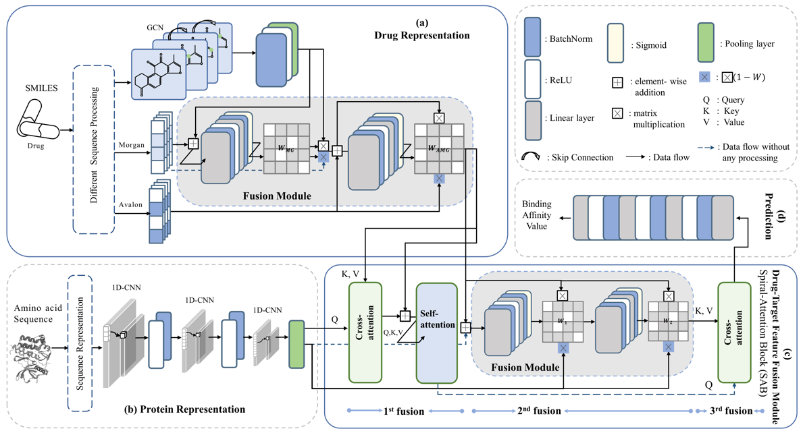

# MFFDTA

A Pytorch Implementation of paper:

**MFFDTA: Multi-Feature Fusion Network for Drug-Target Affinity Prediction**

 Jinghong Sun, Han Wang, Jia Mi, Jing Wan, and Jingyang Gao


The development of drug-target affinity (DTA) prediction tasks significantly drives the drug discovery process forward. Leveraging the rapid advancement of artificial intelligence (AI), DTA prediction tasks have under gone a transformative shift from wet lab experimentation to machine learning-based prediction. This transition enables a more expedient exploration of potential interactions be tween drugs and targets, leading to substantial savings in time and financial resources. However, many existing deep learning methods exhibit insufficient information extraction capabilities regarding drugs and targets, with inadequate emphasis on the fusion process between the two entities. In response to these challenges, we propose MFFDTA, an enhancement to the DTA prediction method, aimed at further refining its predictive capabilities. The drug representation module conducts three-tiered feature extraction on drug molecules and integrates them into the final drug representation. Additionally, we introduce a Spiral-Attention Block (SAB) as an attention-based drug-target feature fusion module, facilitating a triple fusion process between them. This mechanism, to some extent, simulates the interactions between drugs and targets, thereby enabling outstanding performance in our experiment. Our regres sion task on the Davis and KIBA datasets demonstrates the predictive capability of MFFDTA, with CI and MSE metrics showing respective improvements of 3% and 9.9% over the state-of-the-art (SOTA) method in the primary ex perimental group. Furthermore, classification experiments on these datasets, as well as on Metz and BindingDB, further validate MFFDTA’s proficiency in DTA prediction.

## 0. Overview of MFFDTA



Set up the environment:

In our experiment we use, Python 3.8.0 with PyTorch  2.0.1.

```
git clone https://github.com/shly-lab/MFFDTA.git
conda env create -f environment.yml
```

# 1. Dataset

The data should be in the format .csv: 'smiles', 'target_sequences', 'affinity'.

# 2. How to train

```
nohup python train.py 2>save_result/train&
```

# 3. To train YOUR model:

Your data should be in the format .csv, and the column names are: 'smiles', 'target_sequences', 'affinity'.

Generate the drug feature file from the given document using the [AMF.py](http://amf.py/)

Then you can freely tune the hyperparameter for your best performance.

